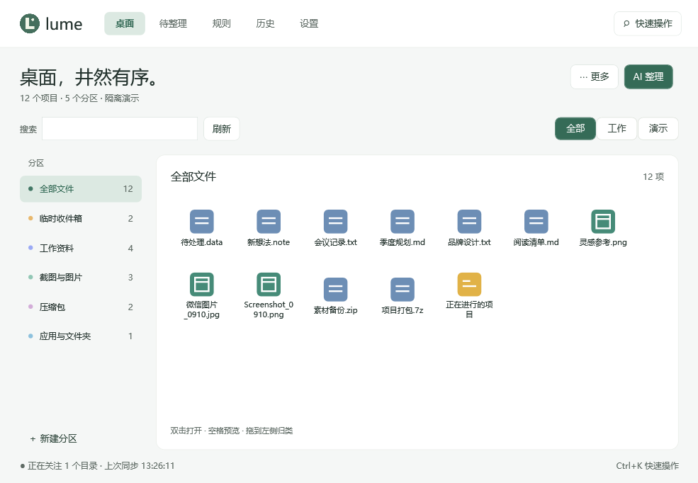

<p align="center"></p>

# Lume · 桌面整理

轻巧的 Windows 桌面分区工具。文件各归其位，普通归类保留原文件位置。

[](https://github.com/963072676/Lume/actions/workflows/ci.yml)
[](https://github.com/963072676/Lume/releases/latest)
[](LICENSE)



## 下载与运行

到 [Releases](https://github.com/963072676/Lume/releases/latest) 下载 **0.1.0**：

| 下载包 | 适用情况 |
| --- | --- |
| `Lume-0.1.0-win-x64.zip` | 完整便携版，自带运行环境，解压即用 |
| `Lume-0.1.0-win-x64-lite.zip` | 精简版，需要 .NET 10 Windows Desktop Runtime x64 |

适用于 Windows 10 2004 及以上、Windows 11，x64。解压后运行 `Lume.exe`，保留同目录的 DLL 和 `shell-extension.txt`。
程序默认显示桌面分区并驻留托盘，双击托盘图标打开管理窗口；关闭窗口继续运行，托盘退出恢复 Windows 原桌面。

## 可以做什么

- **桌面分区**：拖动、缩放、锁定、折叠、排序，多显示器布局与工作/演示视图。
- **快速整理**：拖放归类、规则自动归类、目录映射与最近文件；普通归类不移动原文件。
- **查找与预览**：搜索、Ctrl+K 快速操作、空格预览、Ctrl/Shift 多选，每页最多 80 项。
- **AI 辅助**：配置兼容服务，先查看建议再应用，支持取消与撤销。
- **可恢复操作**：归类历史、布局备份；物理归档先预览，同名不覆盖，保留恢复记录。
- **系统集成**：托盘、开机启动、桌面右键菜单，以及 Windows 系统桌面入口。

[使用说明](docs/使用说明.md) · [开发指南](docs/开发指南.md) · [更新记录](CHANGELOG.md)

## 从源码构建

需要 Windows x64、PowerShell 7、.NET 10 SDK，以及安装了“使用 C++ 的桌面开发”组件的 Visual Studio 2022 或更新版本构建工具。

```powershell
git clone https://github.com/963072676/Lume.git
cd Lume
./scripts/build.ps1                         # 完整便携版
./scripts/build.ps1 -FrameworkDependent     # 精简版
./scripts/package.ps1                       # 压缩包与 SHA-256
./scripts/verify.ps1 -SkipInteractive        # 自动检查，不操作真实鼠标
```

产物写入 `artifacts/`。SDK 可从 PATH、项目 `.tools/dotnet` 或 `DOTNET_ROOT` 查找，也可用 `-DotnetPath` 指定。
完整桌面验收使用 `./scripts/verify.ps1`，会短暂显示窗口、移动鼠标，需要解锁的 Windows 桌面。

## 数据与边界

配置保存在 `%LOCALAPPDATA%\Lume`，保存时保留上一份 `.bak`。已有本地分区、规则、布局及 AI 配置可继续使用。
API Key 使用 Windows 当前用户加密；AI 默认发送文件名称、应用信息与分区信息，不发送完整路径、正文或截图。开启 AI 前请确认服务方的数据处理方式。

只扫描关注目录第一层。壁纸柔化基于静态壁纸；不提供全盘索引、自动更新或定时归档。
物理归档拒绝链接、目录联接与云占位路径。外部 AI 效果、跨卷归档与不同显示器组合需要在实际环境验证。

## 参与项目

欢迎通过 [Issues](https://github.com/963072676/Lume/issues) 提交问题或建议，修改前可阅读 [贡献指南](CONTRIBUTING.md)。
安全问题请按 [安全说明](SECURITY.md) 私下报告。

代码采用 [MIT 许可证](LICENSE)。
