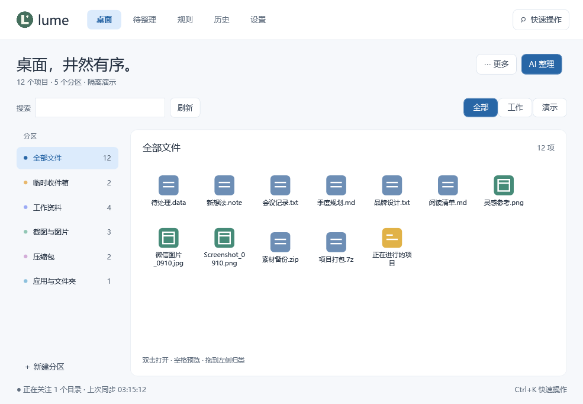

<p align="center"></p>

# Lume · 桌面整理

轻巧的 Windows 桌面分区工具。文件各归其位，普通归类保留原文件位置。

[](https://github.com/963072676/Lume/actions/workflows/ci.yml)
[](https://github.com/963072676/Lume/releases/latest)
[](LICENSE)



## 下载与运行

稳定版为 [0.1.0](https://github.com/963072676/Lume/releases/tag/v0.1.0)。完整备份、慢 Shell 请求隔离、过期引用清理与大目录搜索优化可下载 **[0.2.0-beta.5 预览版](https://github.com/963072676/Lume/releases/tag/v0.2.0-beta.5)**，升级前请先阅读[升级与回退](docs/升级与回退.md)。以下功能说明对应预览版源码。

| 下载包 | 适用情况 |
| --- | --- |
| `Lume-0.2.0-beta.5-win-x64.zip` | 完整便携版，自带运行环境，解压即用 |
| `Lume-0.2.0-beta.5-win-x64-lite.zip` | 精简版，需要 .NET 10 Windows Desktop Runtime x64 |

适用于 Windows 10 2004 及以上、Windows 11，x64。解压后运行 `Lume.exe`，保留同目录的 DLL 和 `shell-extension.txt`。
程序默认显示桌面分区并驻留托盘，双击托盘图标打开管理窗口；关闭窗口继续运行，托盘退出恢复 Windows 原桌面。请保留 `Lume.Guard.exe`，它负责异常退出后的桌面恢复。

预览版的回收站实物清空、真实休眠、多屏和 Explorer 重启验收尚未完成，环境边界及故障处理见[支持与已知问题](docs/支持与已知问题.md)。上方截图来自 beta.5 的隔离演示，使用虚构文件；主题实渲染截图见[主题预览](docs/主题预览.md)。

下载包附 SHA-256，beta.5 起的 GitHub 发布还提供来源证明；检查方法见[验证下载](docs/验证下载.md)。本地自建包与 GitHub 包的哈希可能不同。

## 可以做什么

- **桌面分区**：拖动、缩放、锁定、折叠、排序，多显示器布局与工作/演示视图。
- **快速整理**：拖放归类、规则自动归类、目录映射与最近文件；普通归类不移动原文件。
- **查找与预览**：搜索、Ctrl+K 快速操作、空格预览、Ctrl/Shift 多选，每页最多 80 项。
- **慢请求恢复**：快捷目标、文件/媒体图标和系统入口图标在独立进程读取；超时显示备用图标并可重试，空闲后退出。
- **AI 辅助**：配置兼容服务，先查看建议再应用，支持取消与撤销。
- **可恢复操作**：归类历史、布局和完整数据备份；物理归档先预览，同名不覆盖，保留恢复记录。
- **过期引用清理**：先检测、等待、预览和完整备份，再清理失踪文件的旧记录；保护手动设置，可撤销，不删除原文件。[使用方法](docs/过期引用清理.md)
- **系统集成**：托盘、开机启动、桌面右键菜单，以及 Windows 系统桌面入口。

[使用说明](docs/使用说明.md) · [开发指南](docs/开发指南.md) · [更新记录](CHANGELOG.md)

## 从源码构建

需要 Windows x64、PowerShell 7、`global.json` 指定的 .NET 10.0.400 SDK，以及安装了“使用 C++ 的桌面开发”组件的 Visual Studio 2022 或更新版本构建工具。

```powershell
git clone https://github.com/963072676/Lume.git
cd Lume
./scripts/build.ps1                         # 完整便携版
./scripts/build.ps1 -FrameworkDependent     # 精简版
./scripts/package.ps1                       # 压缩包与 SHA-256
./scripts/verify.ps1 -SkipInteractive        # 自动检查，不操作真实鼠标
```

产物写入 `artifacts/`。SDK 可从 PATH、项目 `.tools/dotnet` 或 `DOTNET_ROOT` 查找，也可用 `-DotnetPath` 指定。
完整桌面验收使用 `./scripts/verify.ps1`，会短暂显示窗口、移动鼠标，需要解锁的 Windows 桌面。

## 数据与边界

配置保存在 `%LOCALAPPDATA%\Lume`，保存时保留上一份 `.bak`。已有本地分区、规则、布局及 AI 配置可继续使用。格式 2 / 3 将设置与历史分开存储，不能只备份 `state.json`；设置页支持完整数据 ZIP 备份、校验恢复和脱敏诊断导出。旧格式首次升级前自动完整备份到 `%LOCALAPPDATA%\Lume-backups`，同时保留 `state.json.legacy.bak`。执行过期引用清理后升级为格式 3，回到 beta.1–beta.4 时需恢复清理前完整备份。完整备份含真实路径与账户加密的 AI 设置，应私下保管。
API Key 使用 Windows 当前用户加密；AI 默认发送文件名称、应用信息与分区信息，不发送完整路径、正文或截图。开启 AI 前请确认服务方的数据处理方式。

只扫描关注目录第一层。壁纸柔化基于静态壁纸；不提供全盘索引、自动更新或定时归档。
物理归档拒绝链接、目录联接与云占位路径。外部 AI 效果、跨卷归档与不同显示器组合需要在实际环境验证。

## 参与项目

欢迎通过 [Issues](https://github.com/963072676/Lume/issues) 提交问题或建议，修改前可阅读 [贡献指南](CONTRIBUTING.md)、[架构与贡献任务](docs/架构与贡献任务.md)、[复盘与优化](docs/复盘与优化-2026-10.md)和[性能复测](docs/性能复测.md)。
安全问题请按 [安全说明](SECURITY.md) 私下报告。

代码采用 [MIT 许可证](LICENSE)。
