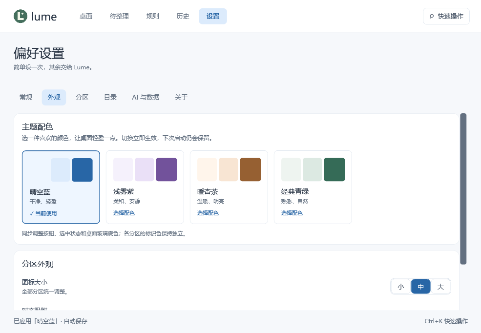
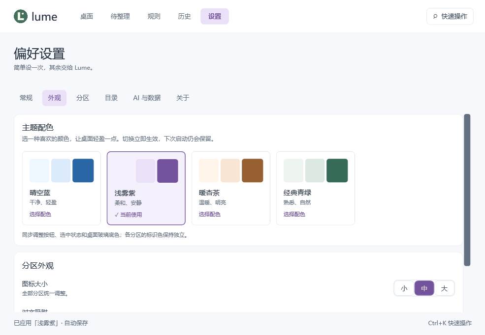
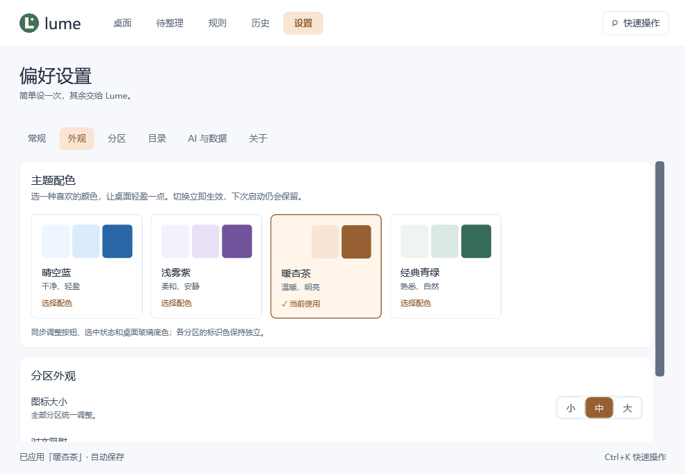
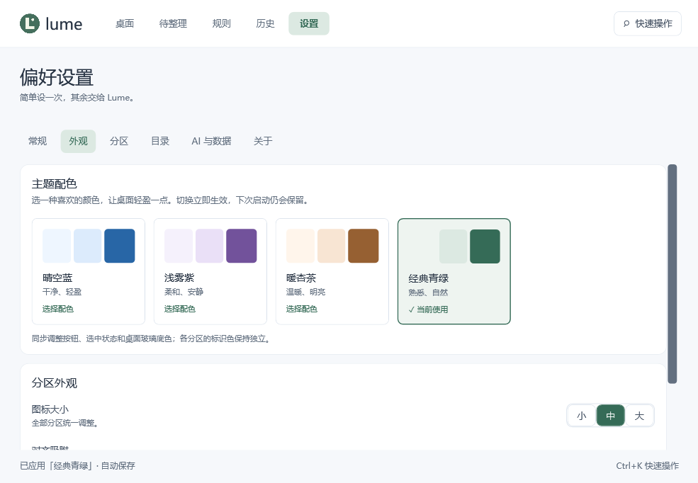

# 主题预览

以下截图来自 0.2.0-beta.5 的 Windows 11 WPF 实渲染验收，使用隔离演示数据，没有个人文件或路径。显示的是管理窗口的主题设置页；不代表所有壁纸、显示器和真实桌面玻璃效果。

| 晴空蓝（默认） | 浅雾紫 |
| --- | --- |
|  |  |

| 暖杏茶 | 经典青绿 |
| --- | --- |
|  |  |

从“设置 → 外观”选择主题，立即保存并更新已有共享画刷。分区标识色和底色深浅各自保留，主题不改变归类规则或文件位置。

验收还检查主题切换保留设置控件、更新实际屏幕外分区底色及文字对比度；没有模拟鼠标悬停或操作用户桌面。不同缩放和读屏环境仍需实机检查。
