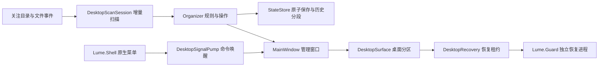

# 架构与贡献任务

`Lume.Core` 不依赖 WPF，负责规则、状态、归档和诊断；`Lume.Desktop` 负责 UI、扫描调度及 Windows 集成；`Lume.Shell` 包含 C++ 菜单和恢复进程。验收入口只编入独立验收包，正式包不带测试命令。

操作边界：普通归类保留原文件位置；物理归档需预览、冲突检查和恢复记录。界面外观保存使用独立设置事务，避免复制历史；不可绕过 StateStore 直接写状态文件。桌面接管及恢复必须校验窗口与进程身份。

## 可独立贡献的任务

| 任务 | 完成标准 |
| --- | --- |
| 实机环境记录 | 使用虚构桌面文件，记录 OS、缩放、操作、退出恢复和诊断结果；区分自动与人工验收 |
| 新主题截图与短演示 | 使用演示数据，不含个人路径；注明版本和主题 |
| 键盘与辅助功能检查 | 检查焦点顺序、无鼠标操作、读屏名称；给出可复现问题和修复 |
| 性能趋势分析 | 复用性能脚本，记录同环境前后对比，说明样本及测量局限 |
| 素材来源清单 | 核实图标与截图的来源和授权依据，不推测来源 |

## 维护约定

提交较大改动前先讨论；小修复可直接 PR。维护者按数据安全、崩溃恢复、日常交互、性能的顺序处理问题，不承诺固定响应时间。发布前核心与自动验收必须通过，未验证场景写入发布说明。预览版不自动替换稳定版下载，数据格式变化必须提供升级和回退说明。
