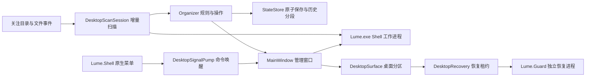

# 架构与贡献任务

```mermaid
flowchart LR
    Files[关注目录与文件事件] --> Scan[DesktopScanSession 增量扫描]
    Scan --> Organizer[Organizer 规则与操作]
    Scan --> Worker[Lume.exe Shell 工作进程]
    Organizer --> State[StateStore 原子保存与历史分段]
    Organizer --> UI[MainWindow 管理窗口]
    UI --> Desktop[DesktopSurface 桌面分区]
    UI --> Worker
    Shell[Lume.Shell 原生菜单] --> Signals[DesktopSignalPump 命令唤醒]
    Signals --> UI
    Desktop --> Recovery[DesktopRecovery 恢复租约]
    Recovery --> Guard[Lume.Guard 独立恢复进程]
```

`Lume.Core` 不依赖 WPF，负责规则、状态、归档和诊断；`Lume.Desktop` 负责 UI、扫描调度及 Windows 集成；`Lume.Shell` 包含 C++ 菜单和恢复进程。验收入口只编入独立验收包，正式包不带测试命令。

快捷目标和图标提供程序在独立 STA 工作进程运行，经有限命名管道返回元数据/像素；超时、所有权、重建及空闲回收约定见[Shell 请求隔离](Shell请求隔离.md)。不要将原生调用的线程池等待超时当作调用已经结束，也不要在工作进程入口运行配置迁移或桌面接管。

操作边界：普通归类保留原文件位置；物理归档需预览、冲突检查和恢复记录。界面外观保存使用独立设置事务，避免复制历史；不可绕过 StateStore 直接写状态文件。桌面接管及恢复必须校验窗口与进程身份。

`ReferenceRetention` 只清理已有等待期和再次缺失证据的自动归属/学习样本。`WindowsReferenceProbe` 在所属工作进程检测固定磁盘路径并返回目录身份；完整备份先于复检与事务提交。格式 3 的历史保存被移除归属，旧版必须使用清理前备份回退。不要把扫描遗漏、隐藏文件、目录失联或手动引用当成删除证据。

`CollectionQuery` 在扫描/配置变化后建立当前分组，按分区排序设置复用结果；缓存限制文件引用数量，搜索结果不长期缓存。管理窗口只复用当前页控件，重新绑定选择并脱离旧页面，避免缓存控件保留整棵旧控件树。

`FileSearch` 一次解析关键词，返回有界、只读结果并支持遍历取消。`CommandPalette` 合并连续输入，在后台读取稳定扫描快照；查询文字、文件列表或分区变化时丢弃旧结果。执行前等待当前查询，关闭时取消；仅验收构建有阻塞扫描注入点，正式包不编译该检查代码。

## 可独立贡献的任务

| 任务 | 完成标准 |
| --- | --- |
| 实机环境记录 | 使用虚构桌面文件，记录 OS、缩放、操作、退出恢复和诊断结果；区分自动与人工验收 |
| 新主题截图与短演示 | 使用演示数据，不含个人路径；注明版本和主题 |
| 键盘与辅助功能检查 | 检查焦点顺序、无鼠标操作、读屏名称；给出可复现问题和修复 |
| 性能趋势分析 | 复用性能脚本，记录同环境前后对比，说明样本及测量局限 |
| 素材来源清单 | 核实图标与截图的来源和授权依据，不推测来源 |

## 维护约定

提交较大改动前先讨论；小修复可直接 PR。维护者按数据安全、崩溃恢复、日常交互、性能的顺序处理问题，不承诺固定响应时间。发布前核心与自动验收必须通过，未验证场景写入发布说明。预览版不自动替换稳定版下载，数据格式变化必须提供升级和回退说明。
